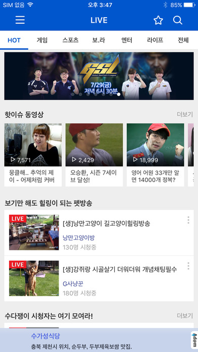
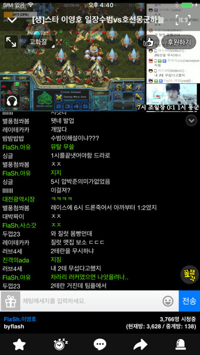
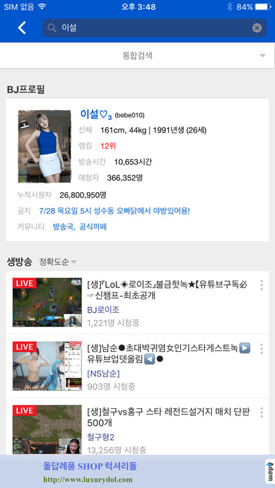

# 이력서

Facebook : https://www.facebook.com/changgwi.lee

Github : https://github.com/lcg5450

## 경력

[아프리카TV](http://www.afreecatv.com/)
- 2012/10/22 ~ now

[인스모바일]
- 2008/11/17 ~ 2012/09/21

[무빙스타]
- 2007/08/01 ~ 2008/11/14

## 회사 프로젝트

### 아프리카TV v2.0
- 소속 : 아프리카TV
- 역할 : iOS 앱 개발 및 파트장 업무 수행
- 개발기간 : 2014-08-01 ~ now
- 사용기술 : iOS, Objective-C, CoreData, Realm, Extension, Fastlane, GPUImage, Swift
- AppStore (https://itunes.apple.com/kr/app/%EC%95%84%ED%94%84%EB%A6%AC%EC%B9%B4tv-afreecatv-korean/id334185830?mt=8)

  

### 일본 아프리카TV
- 소속 : 아프리카TV
- 역할 : iOS 앱 개발
- 개발기간 : 2014-03-03 ~ 2014-06-30 (3개월)
- 사용기술 : iOS, Objective-C, CoreData
- AppStore (https://itunes.apple.com/kr/app/afreecatv-afurikatv-gao-hua/id845118646?mt=8)

### 아프리카TV v1.0
- 소속 : 아프리카TV
- 역할 : iOS 앱 개발 및 파트장 업무 수행
- 개발기간 : 2012-10-22 ~ 2014-07-31 (1년 9개월)
- 사용기술 : iOS, Objective-C, CoreData
- v2.0으로 리뉴얼 됨

### R2 JumpingRace
#### 사내 개발 케릭터 소개 앱 개발
- 소속 : 인스모바일
- 역할 : iOS 앱 개발
- 사용기술 : iOS, Objective-C, Cocos2d

### SuperHero R2
#### 사내 개발 케릭터 소개 앱 개발
- 소속 : 인스모바일
- 역할 : iOS 앱 개발
- 사용기술 : iOS, Objective-C

## 개인 프로젝트

### 만드는중. 아직 없음.

